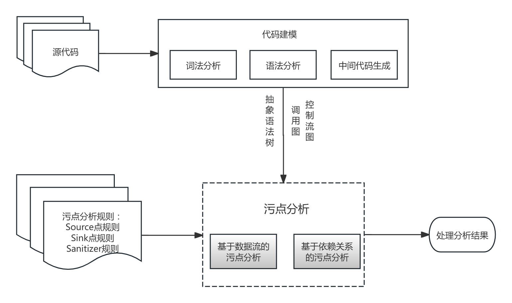

# 静态污点分析
**污点分析（又称源点-汇点分析，source and sink analysis）是对程序中输入数据从“源”到“汇”的流动路径进行追踪分析的方法。**
## 基本概念
### 污点
在代码分析中，常常将来自程序之外的、并且进入程序内部的信息当做污点信息。

根据分析的需要，程序内部使用的数据也可作为污点信息，比如在分析程序是否会将用户的隐私信息泄露到程序外时，可以将从数据库中读取的用户的隐私信息作为污点信息。
### Source点（污点源）
Source是指程序中那些引入不可信数据或敏感数据的代码位置。​

Source的核心作用是为污点分析标记分析的起点。
### Sink点（污点汇聚点）
作为污点分析的终点。Sink就是指软件中那些直接产生安全敏感操作或可能导致隐私内容泄露的代码位置。

Sink的核心作用即倘若被标记为“污点”的数据最终流入了Sink点，就很可能意味着存在安全漏洞。
### Sanitizer点（无害处理点）
它代表了经过资料清洗、加密或验证等手段使污点数据不再对系统安全构成威胁的代码位置。

Sanitizer的核心作用是对污点数据的无害化处理。
### 污点信息传播规则
污点信息的传播规则定义了被**标记的“污点”数据在程序执行过程中如何流动和扩散。**

在应用传播规则进行污点信息的传播时，传播数据流又分为两种，分别为：
- 通过数据依赖传播的显式数据流，比如对于语句`z = x + y`，如果`x`是被污染的，那么结果`z`也是被污染的；
- 通过控制依赖传播的隐式数据流，比如对于语句:
    ``` python
    if(x>0):
        {y=1}
    else:
        {y=0}
    ```
    假如`x`是被污染的，那么`y`也应该是被污染的。

## 污点分析挖掘漏洞

基于污点分析的漏洞挖掘有两种方法：
- 基于数据流的污点分析方法：利用中间表示、控制流图以及过程调用图等分析污点信息在程序路径上流动的方法；
- 基于依赖关系的污点分析方法：使用代码依赖图或者利用程序中的数据依赖关系或者控制依赖关系，分析敏感操控。
### 基于数据流的污点分析
为追求分析精度，常常需要一些辅助分析技术的支持，比如别名分析、变量取值分析和指向分析等。
在基于数据流的污点分析的过程中，既可以沿着程序执行路径的方向分析污点信息的流向，检查Source点处程序接收的污点信息是否会影响到Sink处的敏感操作。也可以从检查Sink点开始逆向分析，检查敏感操作是否会受到污点信息的影响。
在实际的分析中，常常使用正向的污点分析，这主要是由于一方面正向的分析和信息流的方向是一致的，分析过程更自然，另一方面，辅助分析常常是和程序执行的方向一致的，正向污点分析可以和辅助分析同时进行。
#### 过程内分析
**在过程(函数或方法)内的分析中，需要按照一定的顺序分析过程内的每一条语句，进而分析污点信息的流向。**
在考虑怎样分析程序语句之前，先要确定怎样记录污点信息。
##### （一）记录污点信息
- 在静态分析层面，变量的污染情况为主要关注对象。为记录污点信息，通常为变量添加一个污染标签。
- 也可以不采用污染标签。在这种情况下，通过使用对变量进行跟踪的方式达到分析污点信息流向的目的。
```php
String str = getInput();
String sql = prefix + str;
str = "";
```
变量str的内容来自于外部输入，因此认为它是被污染的，直接对str进行跟踪。然后变量sql的的取值受到str的影响，也被污染，此时选择先对sql变量进行跟踪，然后再对str进行跟踪。第三行str变量被赋值为空字符串，认为其被净化，取消对str的跟踪，继续跟踪上一个污染变量。
##### （二）软件语句的分析
在污点分析过程中，不同类型语句的污点传播规则是不同的，重点要求关注赋值语句、分支控制语句和过程调用语句。
1. 赋值语句

| 赋值语句类型 | 污点传播规则 |
| :---: | :---: |
|a = b|设置a的标签为b的标签|
|a = b + c|a的标签取b和c标签的并集|
|a[i] = b|在能确定i的取值或取值范围的情况下，将数组a中对应元素的标签设置为b的标签。否则将a中所有元素的标签设置为b的标签|
|a.f1 = b|将对象a的f1属性的标签设置为b的污染标签|
|a = F(b, …)|根据F函数的逻辑来判断是否将a的标签设置为b的标签|

2. 分支控制语句
在分析分支控制转移语句时，需要重点关注的是这类语句中的路径条件是否包含对污点材料的限制。
为了使分析精确，如果得出路径条件的限制是足够的，那么可以将相应的变量标记为未污染的。
```php
if(a[i] == '>'){
    ...
}
```
如果在检测的过程中，数组变量a被标记为污染的，那么经过这样的对数组变量取值的限制，在这个if语句块内，允许认为a[i]元素是安全的。

对于循环语句，通常规定循环变量的取值范围不能来自输入数据，或者说循环变量的取值范围不能受到输入的控制。
3. 过程调用语句
对于过程（函数）调用语句的分析或处理，可以使用过程间的分析或者直接应用过程摘要进行分析。

过程摘要核心描述该过程怎样改变与该过程相关的变量的污染状态，以及对哪些变量的污染状态进行检查。这些变量可以是过程使用的参数、参数的字段、过程的返回值或过程内使用的全局变量等等。

在实际过程间分析中，可以对已经分析过的过程构建过程摘要。例如，在分析函数c之后，其过程摘要可描述为：函数c接受参数，但是内部会对参数进行净化，并且它的返回值是未受污染的。若是再次得分析调用函数c的语句，那么就可以应用上述的摘要确定调用函数c对变量的污染情况的影响。
##### （三）敏感流分析、上下文敏感分析与域敏感分析
- 流敏感(flow sensitive)的分析在其分析过程中考虑程序的控制流。例如，给定一个程序片段`p=&a;q=p;p=&b`，流敏感的指向分析允许判断q不指向b。
- 在非流敏感的(flow insensitive)分析中，忽略了程序点之间的控制流信息，因此要比流敏感分析的精度低，但是具有更高的效率。以上述代码片段为例，流不敏感的分析包括“q可能指向a或b”,伴随着分析精度的降低，计算复杂性也随之降低。
- 上下文敏感(context sensitive)的分析是指程序的上下文影响程序的过程间分析。比如，当过程P在调用点c1被调用时，对过程P的分析结果将会仅仅返回给c1。相反地，一个非上下文敏感的分析，会将P的分析结果返回给所有P的调用点。
- 域敏感(field sensitive)的分析方法能够区分处理同一复杂数据结构的不同域(即能够区分形如`p.a`和`p.b`的不同域成员引用)。
- 非域敏感(field insensitive)的分析方法则将复杂数据结构作为统一整体进行近似处理。
#### 过程间分析
**过程间分析通常用于关注过程调用对当前上下文的影响，以及构建过程摘要，并利用已有的摘要进行过程内分析。**

**使用自底向上的分析方法，分析调用图中的每一个过程，进而对程序进行整体的分析。**
### 基于依赖关系的污点分析
**在基于依赖关系的污点分析中，将首先利用程序的中间表示、控制流图和调用图构造程序完整的或者局部的程序的依赖关系。**
**在分析程序依赖关系之后，再根据污点分析规则，检查Sink点处敏感管理是否依赖于Source点。**


分析程序依赖关系过程可以看做是构建程序依赖图的过程。应用依赖图是一个有向图，节点是程序语句，边表示程序语句之间的依赖关系。
程序依赖图的有向边包括两种类型：
- 素材依赖边：因共享变量而产生的定义与运用关系，通常用虚线箭头表示，方向从定义点指向使用点；
- 控制依赖边：语句的执行与否受控制流语句（如if、while）影响，通常用实线箭头表示，方向从控制条件语句指向受控语句；
```php
int sum(int n){
    int sum = 0;
    int i = 0;
    while(i < n){
        sum = sum + i;
        i = i + 1;
    }
    return sum;
}
```
对应的依赖图如下：

对于一定规模的代码，常常无法准确并且完整地计算软件的依赖关系。
一方面存储和计算大量的依赖关系需要较大的存储空间和计算时间，在空间和时间的消耗上不能满足实际的分析应该。
另一方面，对于很多情况，静态分析不能准确地分析出程序中的一些依赖关系，其本质原因是静态分析的不可判定性。因此，应该按需地构建程序依赖关系，并且优先考虑和污点信息相关的程序代码。
通过在污点分析检测程序漏洞的实际应用中，通常只关心程序上的信息依赖关系，因为虽然基于控制依赖的隐式信息流能够有效地用于传播污点信息，但是和隐式污点信息流相关的工具漏洞常常是相对麻烦的，并且很难被利用。
在构建程序依赖关系时，常常需要用到指向分析的结果，以分析程序语句和内存中数据的依赖关系。
## 总结
污点分析是非常有效的漏洞分析方法，其应用范围也非常广泛。
然而，几乎所有的污点分析技术都只关注**数据依赖上的显式信息流数据传播形式**，而未能覆盖控制依赖上的隐式信息流数据传播形式。但利用隐式信息流传播数据已经在理论和实践中都被证明为是一种有效的信息传递方式。